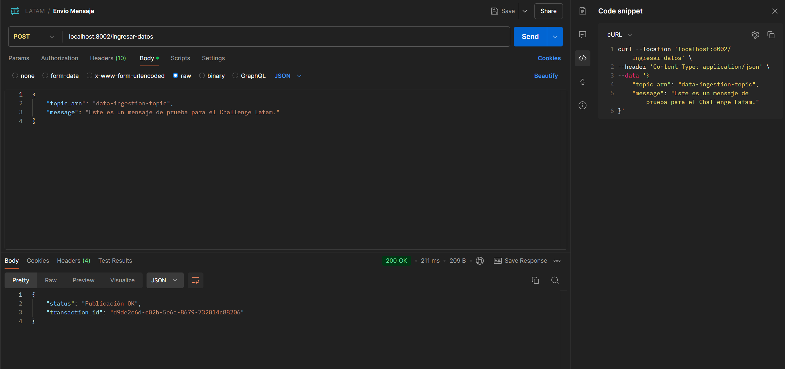

# latam-challenge

# Parte 1 - Infraestructura e IaC
Para utilizar el esquema PUB/SUB, se considerará la utilización de los siguientes servicios:

### 1.1 A.
 - Amazon Simple Notification Service (SNS), quien publicará los mensajes que lleguen desde endpoint
 - Amazon Simple Queue Service (SQS), quien se encargará de procesar los mensajes encolados

### 1.1 B.
Se considero una base de datos Postgres
 - En la siguiente ruta "helm-charts\postgres-citus" se encuentran los helm-chart para montar la base de datos en kubernetes
 - En la siguiente ruta "terraform\db_postgres" se encuentran los códigos terraform para levantar una base de datos con el servicio de RDS de AWS.

### 1.1 C.
Se crearon 2 endpoint usando FastApi con Python
 - POST : {{URI}}/ingresar-datos -> 
 - GET  : {{URI}}/data/{{ID_REGISTRO}}

## 1.2 
Con la ayuda de terraform se crearon los script para la creación de los recursos necesarios
 - Base de datos Postgres SQL -> terraform\db_postgres\main.tf
 - Cluster Kubernetes con AWS -> terraform\cluster_kubernetes\main.tf
 - Amazon Simple Notification Service (SNS) -> terraform\SNS\main.tf
 - Amazon Simple Queue Service (SQS) -> terraform\SQS\main.tf
 - Lambda para montar SQS -> terraform\lambda\main.tf

# Parte 2 - Aplicaciones y flujo CI/CD
  - 2.1 Se crea microservicio llamado "latam_api_sns_publisher" el cual se encarga publicar mensaje en servicio SNS de forma asincrónica con la funcion python "start_publishing_endpoint", de igual forma levanta 2 ENDPOINT:
     * POST:
       Para utilizar este ENDPOINT se debe realizar bajo la siguiente URL "{{URI}}/ingresar-datos".
       
       Información para los headers: 
        - Key: Content-Type
        - Value: application/json
       
       En body se debe enviar en formato json como el siguiente ejemplo:
        {
            "topic_arn": "data-ingestion-topic",
            "message": "Este es un mensaje de prueba para el Challenge Latam."
        }

        El ENDPOINT deberádevolver con un OK e indicar el transaction_id
       

     * GET
       Para utilizar este ENDPOINT se debe realizar bajo la siguiente URL {{URI}}/data/{{ID_REGISTRO}}
       donde se deberáreemplazar la variable "{{ID_REGISTRO}}" por el ID del registro a consultar
       
  - 2.2 Para el proceso CI/CD se recomienda el uso de Jenkins para CI y ArgoCD para el proceso de CD
        - Archivo Dockerfile para crear imagen de API HTTP en ruta "ingreso-datos\publicador\Dockerfile"
        - Archivo Docker para el procesamiento de la información encolada en servicio SQS en ruta "ingreso-datos\suscriptor\Dockerfile"
        - Para el proceso CD de MS API HTTP llamado ""latam_api_sns_publisher"" se utilizo Helm-Charts template el cual se encuentra OK para ser integrado facilmente con ArgoCD
        - Se deberáingresar a la ruta donde se encuentra archivo values.yaml e ingresar el siguiente comando para regenerar archivo principal output.yaml "helm template app-api-publisher ./ > output.yaml"
        - Finalmente aplicar archivo manifiesto .yaml con el siguiente comando "kubectl apply -f output.yaml"
  
  - 2.3 Código de implementación para que el sistema pueda suscribirse se encuentra funcional y de forma asincrónica permitiendo asi cargas altas de consultas
  - 2.4 Lamentablemente, no he podido realizar el diagrama con algún software para mejorar su creación, se adjunta diagrama realizado a mano "diagrama.pdf"

# Parte 3 - Pruebas de integración
 - 3.1 Se considero la creación de test unitarios simples y básicos para cubrir el requerimientos utilizando pytest, ruta "test\test_api.py"
 - 3.2 Para realizar otras pruebas que tengan mayor fidelidad, se recomiendan test sintéticos, se podría utilizar la app de "https://app.getanteon.com/" en este servicio es posible validar con diferentes tipos de carga: Lineal, incremental y en forma de ola (pikcs), aquí un ejemplo del como se podría implementar "test\synthetic_tests.py". De igual forma es recomendable un servicio monitoring fuera de la infraestructura propia como lo es Datadog, con ello tener la seguridad de siempre tener el control de la infraestructura en tiempo real. 
 - 3.3 Se recomienda validar los permisos y privilegios asociados de las services account de los microservicios.
 - 3.4 Para robustecer la infraestructura es fundamental identificar las áreas de vulnerabilidad o posibles fallas en el sistema y luego implementar estrategias que mitiguen esos riesgos:
    * Monitoreo y Alertas Proactivas: Implementar herramientas de monitoreo en tiempo real y configurar alertas automáticas para detectar y responder rápidamente a anomalías.
    * Redundancia y Alta Disponibilidad: Asegurar la redundancia en componentes críticos, implementar clustering y configurar failover automatizado para mantener el sistema operativo incluso en caso de fallos.
    * Escalabilidad Automática: Configurar autoscaling y balanceadores de carga para manejar automáticamente aumentos en la demanda y evitar sobrecargas, configuración del Horizontal Pod Autoscaller y/o Vertical Pod Autoscaller, este último se recomiendas para servicios transaccionales.
    * Evaluación Continua y Mejora: Realizar revisiones periódicas de la arquitectura y adoptar nuevas tecnologías para mejorar la robustez y eficiencia del sistema, como por ejemplo Blue-Green el cual su despliegue consiste en tener dos entornos de producción (Blue y Green) donde el % de propagación del nuevo release es posible controlarlo, aparte de mover el tráfico rápidamente al ambiente Blue en caso de tener algún error internamente en ambiente Blue.

# Parte 4 - Métricas y Monitoreo
 - 4.1 Se proponen las siguiente 3 métricas:
    - Tasa de Errores (Error Rate): Importante es validar que no existan respuestas del tipo 4xx o 5xx.
    2.- Tasa de éxito: Medir el porcentaje de transacciones o procesos clave (como pagos, registros de usuario, procesamiento de datos) que se completan con éxito en el sistema.
    3.- Latencia: Medición critica el cual representa lo que demora el sistema en procesar una solicitud y devolver una respuesta al usuario.

 - 4.2 Herramienta de Visualización Propuesta: Datadog, con esta herramienta es posible medir
    - Latencia de Respuesta de la API (API Response Time)
    - Tasa de Errores (Error Rate)
    - Tasa de Éxito en Transacciones o Procesos Críticos (Success Rate of Critical Transactions)
    - Métricas Básicas de Recursos (CPU/RAM/DISK USAGE)
    - Alertas sintéticas web
    - Alertas multisteps API
    - Alertas de monitoreo certificados SSL
    - Alertas de monitoreo en base a LOGs del microservicio
    
    Dado lo anterior y de acuerdo al listado anterior, esto nos podría ayudar para:
    - Monitoreo Integral y Correlación de Datos: Datadog facilita la correlación entre métricas, logs y trazas, proporcionando una visión completa del estado del sistema. Esto permite identificar rápidamente la causa raíz de un problema y tomar medidas correctivas antes de que afecten gravemente a los usuarios.

    - Alertas Inteligentes: Las alertas en Datadog se pueden configurar para que se disparen en función de umbrales específicos, tendencias o condiciones complejas, lo que ayuda a los equipos a priorizar problemas críticos y a minimizar el tiempo de inactividad.

    - Visión Unificada de Sistemas Distribuidos: Con Datadog, es posible monitorear sistemas distribuidos y microservicios en una única plataforma, lo que es crucial para entender cómo interactúan los diferentes componentes del sistema y cómo afectan al rendimiento general.

    - Toma de Decisiones Basada en Datos: Al visualizar datos históricos y tendencias, los equipos pueden identificar cuándo y dónde se necesitan optimizaciones, ya sea en la infraestructura, en el código o en la arquitectura general. Esto permite planificar de manera proactiva la capacidad y evitar problemas antes de que ocurran.

    - Mejora Continua y Evaluación de Impacto: Datadog permite realizar un seguimiento detallado de cómo las mejoras en el sistema afectan a las métricas clave, lo que facilita la implementación de cambios de manera controlada y medible.

 - 4.3 Se debe realizar la instalación del agente correspondiente a datadog e integrarlo en los servicios a utilizar como Kubernetes, importante es no exponer al publico el punto de conexión entre el cluster y datadog, en su lugar configurar un "Private Location" el cual permita encriptar el tráfico saliente de las métricas del servidor hacia datadog, las métricas se obtienen gracias a que el egente captura la información del uso de recursos del cluster por medio de la base de datos etcd de Kubernetes.
 
 - 4.4 Al escalar la solución de un solo sistema a 50 sistemas similares, la visualización en una plataforma como Datadog cambiará significativamente para manejar la complejidad y el volumen de datos
    - Agregación de Datos: Visualización global de métricas con capacidad de desglosar por sistema individual, facilitando el monitoreo general y la identificación de problemas específicos.
    - Mapas de Servicios: Mapas visuales que muestran la interacción entre sistemas, ayudando a detectar problemas en la comunicación y en la arquitectura de microservicios.
    - Integración con APM (Application Performance Monitoring): El Service Map se enriquece con trazas detalladas que te permiten investigar problemas a nivel de solicitud.

 - 4.5 Saturación de las Herramientas de Monitoreo: 
    - Sobrecarga de Datos: A medida que los sistemas escalan, la cantidad de datos generados (logs, métricas, trazas) aumenta exponencialmente. Las herramientas de monitoreo pueden verse abrumadas por la cantidad de información, lo que podría llevar a una disminución en la capacidad de procesamiento, almacenamiento y análisis de datos.
    - Retención de Datos: Al escalar, es posible que los sistemas de observabilidad no puedan retener datos históricos durante el tiempo necesario, lo que dificulta el análisis de tendencias a largo plazo y la identificación de patrones de comportamiento.
    - Tener un sistema propio de monitoreo nos obliga en tener estos puntos en consideración constantemente.

# Parte 5 - Alertas y SRE
## - 5.1 
 - Latencia de Respuesta (Response Time), Regla/Umbral: Alertar si el tiempo medio de respuesta supera los 400ms en más del 5% de las solicitudes durante un periodo de 5 minutos.
        La latencia de respuesta es una métrica crítica porque afecta directamente la experiencia del usuario. Configurar un umbral en el percentil 99 permite capturar los peores casos de latencia sin generar ruido excesivo por anomalías menores. Este umbral garantiza que los usuarios no experimenten retrasos inaceptables, y el periodo de 5 minutos ayuda a evitar alertas por picks breves de latencia.

 - Tasa de Errores (Error Rate), Regla/Umbral: Alertar si la tasa de errores (código de estado 5xx o 4xx) supera el 1% de las solicitudes totales durante 3 minutos consecutivos.
        La tasa de errores es un indicador directo de fallos en el sistema. Un umbral del 1% puede parecer bajo, pero incluso una pequeña proporción de errores puede indicar problemas subyacentes graves, como un fallo en un microservicio crítico. El periodo de 3 minutos ayuda a filtrar las fluctuaciones momentáneas, enfocándose en fallos consistentes.

- Uso de CPU, Regla/Umbral: Alertar si el uso promedio de CPU supera el 80% durante más de 10 minutos.
        Un uso elevado de CPU durante un periodo prolongado puede ser indicativo de sobrecarga en el sistema o de un posible cuello de botella en la aplicación. El 80% es un umbral comúnmente aceptado que permite espacio para manejar picks ocasionales sin saturar completamente la CPU, mientras que el periodo de 10 minutos asegura que la alerta se dispare por un problema sostenido y no por picks breves.
- Uso de Memoria, Regla/Umbral: Alertar si el uso de memoria supera el 90% de la memoria disponible durante 5 minutos.
        Un uso elevado de memoria puede llevar a fallos en la aplicación o a situaciones de swap, lo que afecta el rendimiento. El 90% es un umbral crítico que permite suficiente espacio antes de llegar a un punto de no retorno. Los 5 minutos ayudan a asegurarse de que la alerta no se dispare debido a aumentos temporales en el uso de memoria.
- Disponibilidad (Uptime), Regla/Umbral: Alertar si la disponibilidad del servicio cae por debajo del 99.9% en cualquier periodo de 10 minutos.
        La disponibilidad es un KPI clave para cualquier sistema. Un umbral del 99.9% garantiza que el sistema se mantiene operativo para la mayoría de los usuarios en la mayoría del tiempo. El periodo de 10 minutos asegura que las alertas se emiten solo cuando hay un impacto real y sostenido en la disponibilidad.

## - 5.2 
 - Definir indicadores de nivel de servicio (SLIs) y objetivos de nivel de servicio (SLOs) es esencial para garantizar que los servicios cumplen con los requisitos de calidad y rendimiento acordados. Se proponen las siguientes métricas: 
 
### 1. SLI: Latencia de Respuesta
Definición: Tiempo medio de respuesta de las solicitudes HTTP.
SLO: 95% de las solicitudes deben tener una latencia de respuesta inferior a 200ms durante un periodo de 30 días.

La latencia de respuesta es un SLI crucial porque afecta directamente la experiencia del usuario. Se utiliza el percentil 95 para centrarse en las respuestas más lentas sin incluir los valores extremos, que podrían no representar el rendimiento típico del servicio. Este SLO asegura que el sistema se mantenga dentro de un rango aceptable de latencia la mayor parte del tiempo, ofreciendo una buena experiencia de usuario.

Se descartó el uso de latencias más extremas percentil 99, 99.9 porque podrían introducir demasiadas variaciones debido a outliers poco representativos.
También se evitó establecer un SLO basado en la latencia media, ya que, no capturaría adecuadamente los problemas de latencia experimentados por un pequeño porcentaje de usuarios.

### 2. SLI: Tasa de Errores
Definición: Porcentaje de solicitudes HTTP que devuelven códigos de error 5xx.
SLO: Menos del 0.1% de las solicitudes deben devolver errores 5xx durante un periodo de 30 días.

La tasa de errores es fundamental para la fiabilidad del sistema. Un umbral del 0.1% es lo suficientemente bajo como para asegurar que los errores sean eventos raros y excepcionales. Este SLO busca minimizar las interrupciones y problemas de servicio, manteniendo una alta fiabilidad del sistema.

Se descartó el uso de códigos de estado 4xx, ya que generalmente representan errores del lado del cliente, no del servidor.
También se evitó un umbral más alto para permitir margen de error, ya que esto podría llevar a la aceptación de un nivel inaceptable de fallos.

### 3. SLI: Disponibilidad del Servicio
Definición: Porcentaje del tiempo en el que el servicio está disponible para los usuarios finales.
SLO: El servicio debe estar disponible el 99.95% del tiempo durante un periodo de 30 días.

La disponibilidad es una métrica clave que afecta la percepción de fiabilidad por parte de los usuarios. Un SLO del 99.95% es estándar en la industria y garantiza que las interrupciones sean mínimas y que el servicio sea altamente confiable.

Se descartó un SLO del 100%, ya que es prácticamente inalcanzable en la mayoría de los entornos debido a actualizaciones, mantenimiento, y otros factores inevitables.
También se evitó un umbral más bajo (por ejemplo, 99.9%) porque no ofrecería el nivel de fiabilidad esperado para servicios críticos.

### 4. SLI: Tasa de Retries
Definición: Porcentaje de solicitudes HTTP que requieren un reintento debido a fallos en la comunicación.
SLO: Menos del 1% de las solicitudes deben requerir reintentos durante un periodo de 30 días.

Los reintentos indican problemas de fiabilidad en la comunicación entre servicios o con la base de datos. Un SLO del 1% asegura que los problemas de conectividad son raros y no afectan significativamente la operativa normal.

Se descartó el uso de un umbral más alto porque podría indicar una infrautilización de recursos.
Se evitó un SLO de retries del 0%, ya que en sistemas distribuidos, un pequeño número de reintentos puede ser inevitable.

### 5. SLI: Latencia de Consultas de Base de Datos
Definición: Tiempo medio de ejecución de consultas a la base de datos.
SLO: 95% de las consultas deben ejecutarse en menos de 100ms durante un periodo de 30 días.

La latencia en la base de datos impacta directamente en el rendimiento general del servicio. Un SLO basado en el percentil 95 asegura que la mayoría de las consultas se ejecutan rápidamente, lo que mantiene el sistema ágil y responsivo.

Se descartó el uso del percentil 99 porque podría estar influenciado por pocas consultas anómalas y no reflejar el rendimiento general.
También se evitó un SLO basado en la latencia media, ya que podría ocultar problemas de latencia experimentados por una minoría significativa de consultas.